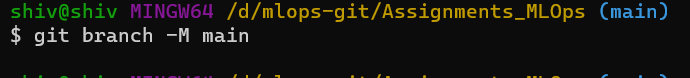

## **Task 1**
#### **Basic Git Commands**  

**Git Commands** | **Description** | **Snapshot**
--- | --- | --- 
git init | Initializes a folder as a git repository for tracking changes |  |
git config --global user.name | To set up git configuration name |  |
git config --global user.email | To set up git configuration email |  |
git remote -v | To check/show remote repositories with URL |  |
git status | To get the status of files and folders in repo |  |
git branch | To get the list of available branches. We can create branch as well. |  |
git checkout | To switch to a given branch by providing it's name |  |
git pull | To pull the remote repository if there are any changes made by collaborators |  |
git add | To add the files and folers to staging |  |
git commit | To commit the changes in the staging and push to the remote repo |  |
git push | Push the commited changes to the remote repo |  |
git log | To review and read a history of everything that happens to a repo |  |
git diff | To see the difference between two files or branches |  |
git show | To view the expanded details on git objects like git tag etc. |  |
git merge | To merge the branch with the main branch | 

## **Task 2**

1. Create an open source repo with proper project structure
  > Please click [here](https://github.com/shiv-dhawan/Assignments_MLOps)

2. Create a detailed README.md file for the above repo
  > Please click [here](https://github.com/shiv-dhawan/Assignments_MLOps/blob/main/README.md)

3. Add 2 collaborators to the repo.
  > Please click [here](Images/)
  
